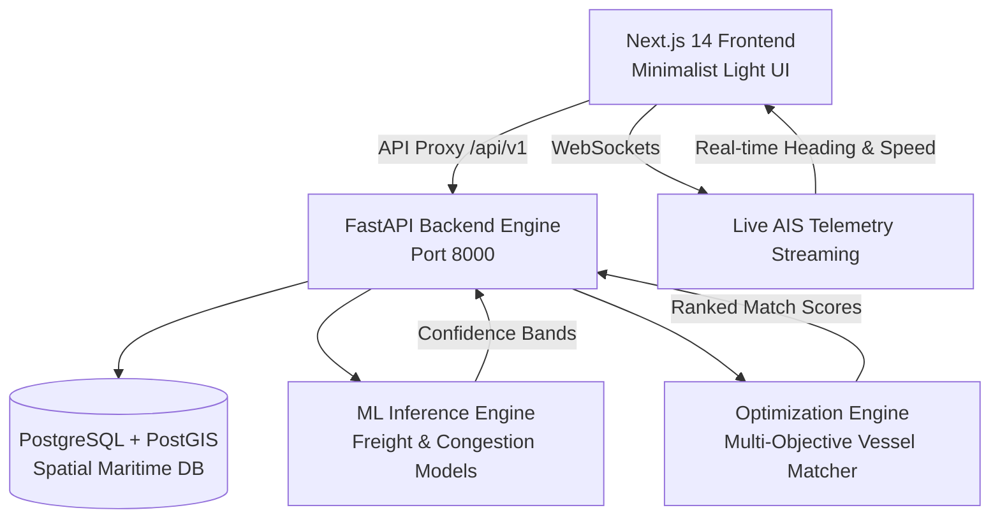

# NAVIQ — SIH26006 Maritime Freight Forecasting & Bulk Chartering Platform

> **Intelligent Maritime Logistics & Bulk Procurement Decision Platform**  
> Problem Statement: **SIH26006** — AI-Driven Freight Rate Forecasting, Real-Time Vessel Matching, Port Congestion Prediction, and Bulk Charter Party Optimization.

---

## 🌊 Overview

**NAVIQ** is a full-stack maritime intelligence platform designed to revolutionize bulk dry cargo procurement (coking coal, thermal coal, iron ore, bauxite, grain) from global export hubs (Australia, Indonesia, South Africa) to the East Coast of India (Paradip, Dhamra, Haldia, Visakhapatnam).

The system integrates four distinct subsystems:
1. **Minimalist Web Application (Next.js 14 + Tailwind CSS + Recharts + Leaflet)** — Clean, high-density interface with zero neon/gradient clutter.
2. **REST & WebSocket API Backend (FastAPI + SQLAlchemy + PostGIS)** — 15+ production endpoints for vessels, ports, charters, and AIS telemetry.
3. **Machine Learning Forecasting Engine (Transformer-v4.2 + Spatial GNN)** — Probabilistic freight rate prediction with 87% confidence bands and 7-day port anchorage waiting time forecasts.
4. **Multi-Objective Optimization Engine** — Reconciles spatial AIS locations, port bathymetry, draft constraints, bunker fuel consumption, and market trends.

---

## 🎯 The Three Core Procurement Questions

NAVIQ is built around answering three fundamental questions for procurement officers:

| Question | AI Subsystem | Output / Decision |
| :--- | :--- | :--- |
| **1. WHICH VESSEL?** | Optimization Engine + PostGIS Spatial Matching | Ranked candidate vessels scored on DWT capacity, maximum draft fit (UKC), and ballast distance. |
| **2. WHEN TO CHARTER?** | ML Freight Forecaster (`Maritime-Transformer-v4.2`) | **WAIT 3 DAYS** (projected rate decline) vs. **BOOK NOW** (projected rate increase). |
| **3. WHAT WILL IT COST?** | Total Outlay Cost Calculator | Itemized breakdown: Base Freight + Singapore VLSFO Bunker Fuel + Port Pilotage Dues + Demurrage Waiting Risk. |

---

## 🏗️ System Architecture



---

## 🚀 Quick Start Guide

### 1. Prerequisites
- **Node.js**: v18+ or v20+ LTS
- **Python**: 3.10+ or 3.11+
- **PostgreSQL / PostGIS** (Optional — High-Fidelity Simulation Mode is built-in)

---

### 2. Running the Frontend

```bash
# Navigate to frontend
cd frontend

# Install dependencies
npm install

# Start Next.js development server
npm run dev
```

Open [http://localhost:3000](http://localhost:3000) in your browser.

> **💡 Simulation / Live Toggle**: The platform includes a **LIVE API / SIMULATION MODE** switcher in the top bar. When the backend is offline, the interface seamlessly falls back to high-fidelity mock data.

---

### 3. Running the FastAPI Backend

```bash
# In project root
python -m venv venv
source venv/bin/activate  # On Windows: venv\Scripts\activate

# Install backend requirements
pip install -r backend/requirements.txt

# Start backend server
uvicorn backend.app.main:app --host 0.0.0.0 --port 8000 --reload
```

Interactive API documentation will be available at [http://localhost:8000/docs](http://localhost:8000/docs).

---

### 4. Running the ML Model & Optimization Engine Standalone

```bash
# Run ML Prediction Tests
python "ML model/src/predict.py"

# Run Optimization Engine Matching
python -m optimization_engine.optimization_engine
```

---

## 🌐 API Endpoints Reference

| Category | Endpoint | Method | Description |
| :--- | :--- | :---: | :--- |
| **Optimization** | `/api/v1/optimization/match-vessels` | `POST` | Match and rank candidate vessels for a cargo requirement. |
| **Optimization** | `/api/v1/optimization/recommend` | `POST` | Generate unified AI charter decision (`WAIT` vs `BOOK NOW`). |
| **Forecasts** | `/api/v1/forecast/freight` | `GET` / `POST` | 14-day ML freight rate forecast with upper/lower confidence bounds. |
| **Congestion** | `/api/v1/congestion/{port_id}` | `GET` | 7-day port anchorage queue and waiting time forecast. |
| **Vessels** | `/api/v1/vessels` | `GET` | Filter vessels by type, DWT, draft, and availability. |
| **Vessels** | `/api/v1/vessels/{id}/position` | `GET` | Retrieve latest live AIS geographic coordinates. |
| **Cargo** | `/api/v1/cargo` | `GET` / `POST` | Manage bulk cargo procurement tenders and laycan windows. |
| **Charters** | `/api/v1/charters` | `GET` / `POST` | Submit and negotiate charter party bids. |
| **Market** | `/api/v1/freight/fuel-price` | `GET` | Get real-time bunker fuel prices (Singapore VLSFO). |
| **AIS WebSocket**| `/api/v1/ws/ais` | `WS` | Real-time streaming AIS vessel coordinates and heading. |

---

## 👥 Role-Based Portals

| Role | Route | Primary Capabilities |
| :--- | :--- | :--- |
| **Procurement Officer** | `/dashboard/procurement` | Cargo requirement creation, AI charter recommendation, vessel comparison matrix, tender dispatch. |
| **Ship Owner** | `/dashboard/ship-owner` | Fleet deployment, cargo marketplace bidding, charter party contracts, revenue projection. |
| **Port Authority** | `/dashboard/port-owner` | Berth allocation (CB-1, CB-2), queue management, 7-day congestion forecast. |
| **System Admin** | `/dashboard/admin` | Global AIS coverage telemetry, ML inference latency, model health monitoring. |

---

## 📦 Deployment

### Deploying Frontend to Vercel
1. Set the Root Directory to `frontend`.
2. Framework Preset: **Next.js**.
3. Environment Variables:
   - `BACKEND_INTERNAL_URL`: Your FastAPI backend URL (e.g., `https://api.yourdomain.com`).
4. Deploy!

---

## 📄 License & Attribution
Developed for **Smart India Hackathon (SIH 2026)** • Problem Statement **SIH26006**.
